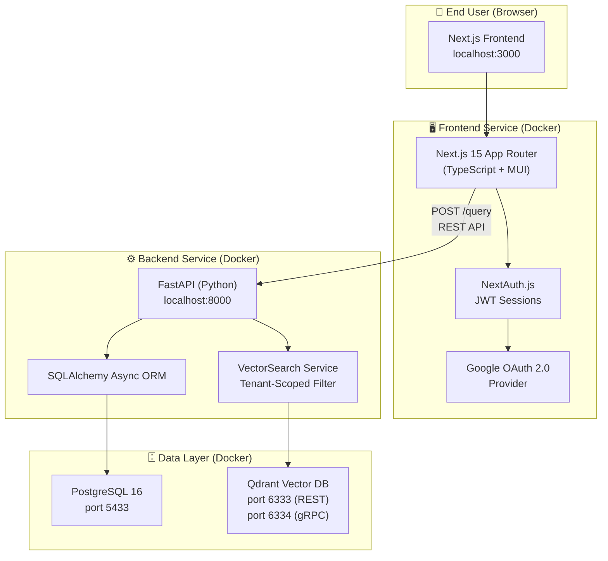
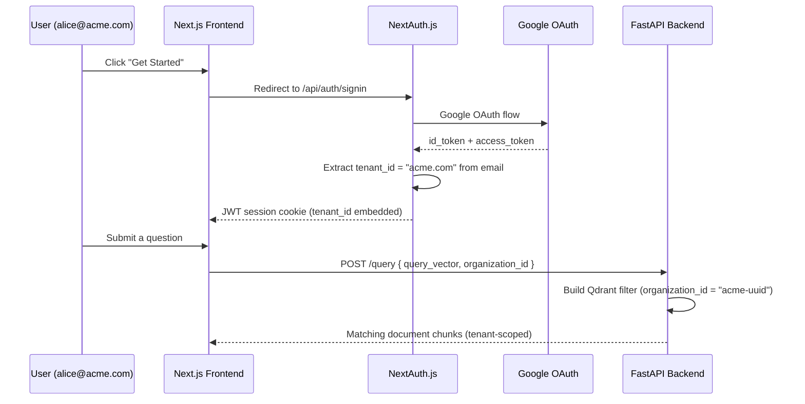
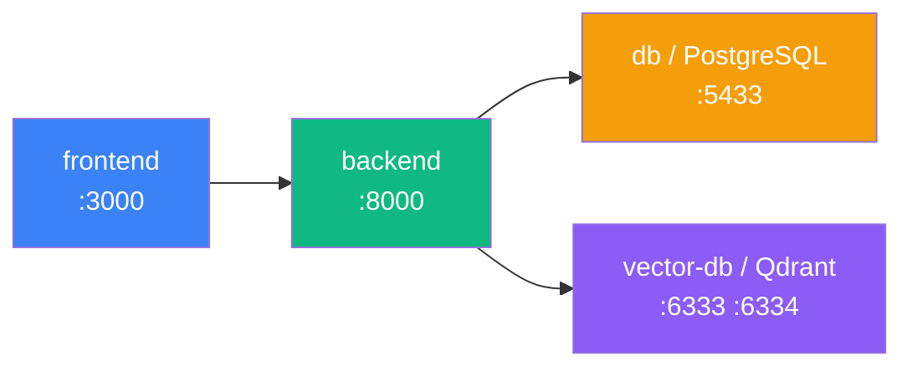

# Enterprise RAG Platform — Architecture Overview

> A **self-hosted, multi-tenant Retrieval-Augmented Generation (RAG) platform** that lets organizations securely query their own knowledge base using AI-powered semantic search.

---

## What It Does (in plain English)

1. A user from Company "acme.com" signs in with their Google account.
2. The system automatically identifies them as belonging to the **"acme.com" tenant**.
3. They ask a question (e.g. *"What is our refund policy?"*).
4. Their question is turned into a **vector embedding** and searched against **only acme.com's documents** — never another company's.
5. The most relevant document chunks are returned as context, ready to be passed to an LLM.

**Key guarantee**: Cross-tenant data leakage is **structurally impossible** — the tenant filter is mandatory at the database level.

---

## System Architecture Diagram



---

## Component Breakdown

### 1. 🖥️ Frontend — `frontend/`

| File | Role |
|------|------|
| `app/page.tsx` | Landing page with feature cards + "Get Started" CTA |
| `app/layout.tsx` | Root layout, MUI theme provider |
| `app/globals.css` | Global CSS styles |
| `lib/auth.config.ts` | NextAuth configuration — Google OAuth, JWT callbacks, tenant extraction |
| `app/api/auth/[...nextauth]/route.ts` | NextAuth catch-all API route handler |
| `types/next-auth.d.ts` | TypeScript type augmentations for `session.tenant_id` |
| `next.config.ts` | Next.js build config |
| `tailwind.config.js` | Tailwind configuration |
| `Dockerfile` | Containerized production build |

**Tech Stack**: Next.js 15, TypeScript, Material UI, NextAuth.js, Tailwind CSS

---

### 2. ⚙️ Backend — `backend/`

| File | Role |
|------|------|
| `main.py` | FastAPI app entry point — 3 routes: `/`, `/health`, `/query` |
| `config.py` | Pydantic Settings — loads all env vars from `.env` |
| `database.py` | Async SQLAlchemy engine + session factory + `get_db` dependency |
| `models/organization.py` | `Organization` ORM model (the tenant entity) |
| `models/user.py` | `User` ORM model — linked to `Organization` via FK |
| `schemas/organization.py` | Pydantic request/response schemas for organizations |
| `schemas/user.py` | Pydantic request/response schemas for users |
| `services/vector_search.py` | Core vector search service — filters results by `organization_id` |
| `requirements.txt` | Python dependencies |
| `Dockerfile` | Containerized production image |

**Tech Stack**: FastAPI, SQLAlchemy (async), asyncpg, Pydantic v2, qdrant-client, uvicorn

---

### 3. 🗄️ Data Layer

#### PostgreSQL (`db` service)
Stores **relational data** — users, organizations, and future metadata like query logs, quotas, document metadata.

```
organizations
  ├── id (UUID, PK)
  ├── name
  ├── domain  ← e.g. "acme.com" — used to auto-assign users
  ├── is_active
  └── created_at / updated_at

users
  ├── id (UUID, PK)
  ├── email
  ├── name / avatar_url / provider
  ├── organization_id (FK → organizations.id)
  ├── is_active / is_admin
  └── created_at / updated_at / last_login_at
```

#### Qdrant (`vector-db` service)
Stores **document embeddings + payloads** for semantic search.

```
Collection: "documents"
Each Point:
  ├── id: UUID
  ├── vector: float[] (dense embedding, e.g. 1536-dim for OpenAI)
  └── payload:
        ├── organization_id  ← MANDATORY tenant filter
        ├── document_id
        ├── chunk_index
        ├── text
        └── metadata: {}
```

---

### 4. 🔐 Authentication & Multi-Tenancy Flow



**How tenant isolation works:**
- On first sign-in, `extractTenantId("alice@acme.com")` → `"acme.com"`
- This domain is stored in the JWT as `tenant_id`
- The frontend includes the `organization_id` (UUID mapped from domain) in every `/query` request
- The backend's `search_by_organization()` makes the `organization_id` filter **mandatory** — it's impossible to query across tenants

---

### 5. 🐳 Infrastructure — `docker-compose.yml`



| Service | Image | Port | Purpose |
|---------|-------|------|---------|
| `frontend` | Custom (Next.js) | 3000 | UI + auth |
| `backend` | Custom (FastAPI) | 8000 | API + vector search |
| `db` | `postgres:16-alpine` | 5433→5432 | Relational metadata |
| `vector-db` | `qdrant/qdrant:latest` | 6333, 6334 | Vector storage & search |

All services communicate over the internal `rag_network` Docker bridge network.

---

## The RAG Query Flow (End-to-End)

```mermaid
flowchart LR
    A["User Question\n'What is our\nrefund policy?'"] -->|Frontend| B["Embedding Model\n(future: OpenAI / local)"]
    B -->|query_vector: float[]| C["POST /query\n+organization_id"]
    C --> D["Qdrant Search\n(filtered by org)"]
    D -->|Top-K chunks| E["Return matched\ndocument text"]
    E -->|Context| F["LLM\n(future: GPT-4, Gemini...)"]
    F --> G["Final Answer\nto User"]
```

> **Current state**: The `/query` endpoint accepts a **pre-computed vector** directly. The embedding model call (step B) and LLM answer generation (step F) are the **next planned pieces** to be wired in.

---

## What's Built vs. What's Next

### ✅ Already Built
- Multi-tenant data models (`Organization` + `User`)
- Async PostgreSQL connection layer
- Tenant-scoped Qdrant vector search service
- FastAPI REST API with `/query`, `/health` endpoints
- NextAuth Google OAuth login with JWT sessions
- Tenant ID auto-extraction from email domain
- Full Docker Compose orchestration for all 4 services
- Landing page UI with MUI components

### 🔲 Planned / Not Yet Built
- **Document ingestion pipeline** — upload → chunk → embed → store in Qdrant
- **Embedding model integration** — OpenAI `text-embedding-3-small` or local model
- **LLM answer generation** — feed retrieved chunks into GPT-4 / Gemini
- **Chat UI** — conversation interface in the frontend
- **Admin portal** — manage organizations, users, documents
- **Query logging / analytics** — track usage per tenant
- **Alembic migrations** — for production-grade DB schema management
- **Custom sign-in / error pages** (`/auth/signin`, `/auth/error`)
